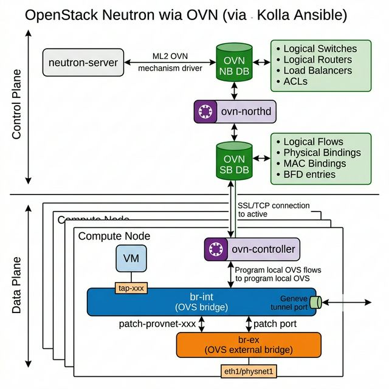
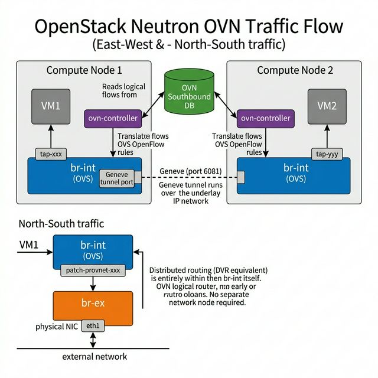
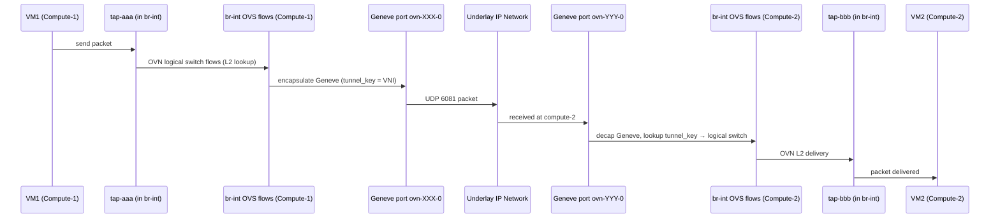
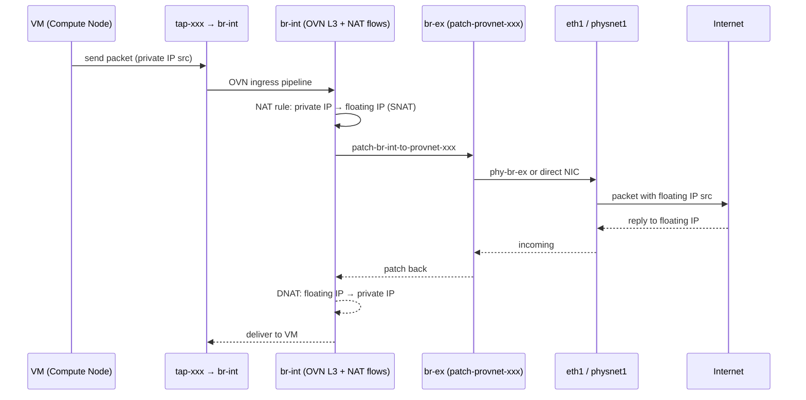
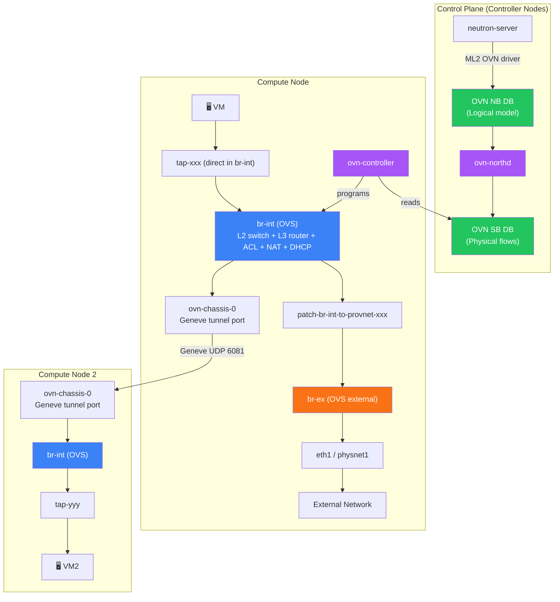
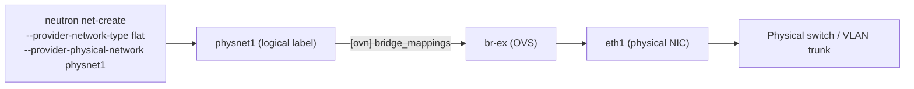
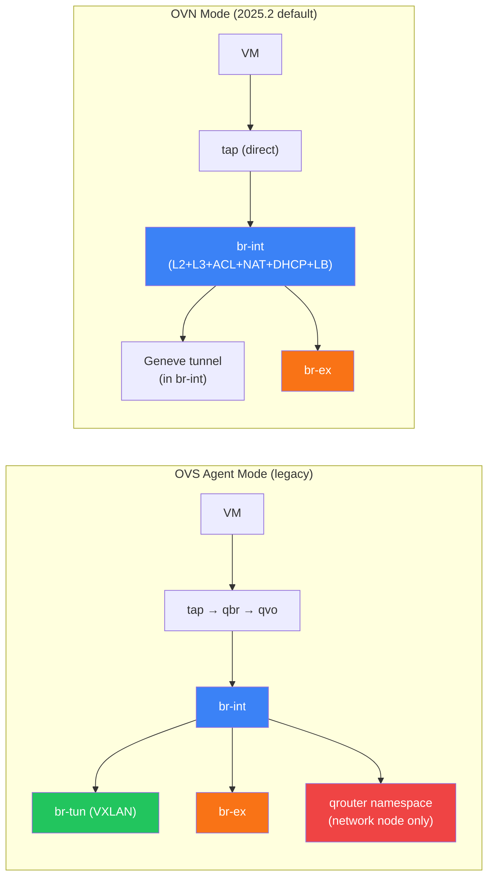

+++
title = "Openstack OVN guide"
date = 2026-04-17
[taxonomies]
tags = ["openstack"]
[extra]
mermaid = true
+++

# OpenStack Neutron Networking with OVN Backend
### Kolla Ansible 2025.2 (Epoxy) — `neutron_plugin_agent: ovn`

---

## Why OVN is Different from OVS

| Feature | OVS (legacy) | OVN |
|---|---|---|
| Tunnel bridge | `br-tun` (separate bridge) | ❌ No `br-tun` — tunnels in `br-int` directly |
| Security groups | `qbr-xxx` Linux bridge + iptables | ✅ Native in OVS flow tables (OVN ACLs) |
| Routing | Network node `qrouter` namespace | ✅ Distributed in every `br-int` (no network node needed) |
| Tunnel protocol | VXLAN / GRE | **Geneve** (port 6081) |
| Agent | `neutron-openvswitch-agent` | **`ovn-controller`** (not a Neutron agent) |
| DHCP | `neutron-dhcp-agent` daemon | ✅ OVN native DHCP (no daemon needed) |
| Control plane | ML2 + OVS agent | **ML2 OVN mechanism driver → OVN NB DB** |
| L3 agent | Required | ❌ Optional / eliminated |

---

## 1. OVN Architecture Overview



OVN operates in two planes:

### Control Plane (runs on controllers)

```
neutron-server
  └── ML2 OVN mechanism driver
        └── OVN NB DB (Northbound Database)   ← logical model
              └── ovn-northd
                    └── OVN SB DB (Southbound Database)  ← physical flows
```

### Data Plane (runs on every compute node)

```
OVN SB DB
  └── ovn-controller  ← reads logical flows, programs OVS
        └── br-int (OVS)  ← executes OpenFlow rules
              ├── tap-xxx  (VM ports)
              ├── geneve tunnel ports  (to other nodes)
              └── patch to br-ex  (external/provider)
```

---

## 2. Component Deep Dive

### 2.1 OVN Northbound Database (NB DB)

The **logical model** of your network. Written to by `neutron-server` via the ML2 OVN driver.

**Key tables:**

| Table | Contains |
|---|---|
| `Logical_Switch` | Neutron networks |
| `Logical_Switch_Port` | Neutron ports (VM VIFs, DHCP, router) |
| `Logical_Router` | Neutron routers |
| `Logical_Router_Port` | Router interfaces |
| `ACL` | Security group rules |
| `NAT` | Floating IPs (SNAT/DNAT rules) |
| `Load_Balancer` | Octavia / Neutron LBaaS |

```bash
# Inspect NB DB (run inside ovn-nb container or on controller)
ovn-nbctl show
ovn-nbctl list Logical_Switch
ovn-nbctl list Logical_Router
ovn-nbctl list ACL
ovn-nbctl list NAT
```

---

### 2.2 OVN Southbound Database (SB DB)

The **physical/flow model** — compiled by `ovn-northd` from NB DB.

**Key tables:**

| Table | Contains |
|---|---|
| `Datapath_Binding` | Tunnel key per logical switch/router |
| `Port_Binding` | Maps logical ports to physical chassis |
| `Logical_Flow` | OpenFlow-like match/action rules |
| `MAC_Binding` | ARP/ND cache |
| `Chassis` | Each compute/network node |
| `BFD` | Tunnel liveness detection |

```bash
ovn-sbctl show
ovn-sbctl list Chassis
ovn-sbctl list Port_Binding
ovn-sbctl list Logical_Flow | head -50
```

---

### 2.3 `ovn-northd` — The Compiler

Translates **NB DB → SB DB logical flows**. Runs on controller nodes (usually 3 for HA).

- Listens to changes in NB DB
- Computes logical flows and physical bindings
- Writes to SB DB
- No data plane involvement

```bash
# Kolla container
docker exec ovn_northd ovn-northd --help
docker logs ovn_northd
```

---

### 2.4 `ovn-controller` — The Data Plane Agent

Runs on **every compute node** (and gateway nodes). Not a Neutron agent — it's an OVN daemon.

- Watches SB DB for its chassis's bindings
- Translates logical flows into **OVS OpenFlow rules** in `br-int`
- Manages Geneve tunnel interfaces between chassis

```bash
# On compute node
docker exec ovn_controller ovn-controller --help
docker logs ovn_controller

# Check chassis registration
ovn-sbctl show  # look for Chassis entries
```

---

### 2.5 `br-int` — The Integration Bridge (OVN style)

Still exists as an **OVS bridge**, but is far more powerful than in OVS-agent mode.

```
br-int responsibilities (OVN):
  ✓ VM port attachment (tap-xxx)
  ✓ Geneve tunnel endpoints (no br-tun!)
  ✓ Distributed L2 switching (logical switch flows)
  ✓ Distributed L3 routing (logical router flows)
  ✓ Security group ACLs (OVN ACL → OVS flows)
  ✓ DHCP reply generation (OVN native DHCP)
  ✓ Floating IP DNAT/SNAT (distributed, no qrouter)
  ✓ Load balancing (OVN native LB)
```

> [!IMPORTANT]
> In OVN, `br-int` does **everything** that OVS used `br-int + br-tun + qrouter namespace` for. The routing happens inside br-int via logical flow tables — no separate network node needed for East-West or floating IPs.

**Ports in OVN br-int:**

| Port | Purpose |
|---|---|
| `tap-xxx` | VM virtual NIC (directly in br-int, no qbr!) |
| `ovn-<chassis>-0` | Geneve tunnel to a remote chassis |
| `patch-br-int-to-provnet-xxx` | Patch to br-ex for provider/external nets |

```bash
ovs-vsctl list-ports br-int
# You will see: tap-xxx, ovn-XXXXXX-0, patch-...

ovs-ofctl dump-flows br-int | head -40
```

---

### 2.6 `tap-xxx` — VM Port (Direct, No qbr!)

Same TAP device as OVS mode, but now plugged **directly into `br-int`** — no `qbr-xxx` Linux bridge in between.

```
VM (Guest OS)
  └── vNIC
        └── tap-a1b2c3d4  → directly into br-int
```

Security groups are enforced via **OVN ACL → OVS conntrack flows** directly on the port in `br-int`.

```bash
# Find tap devices
ip link show | grep tap

# Correlate to Neutron port (port UUID prefix)
openstack port show <uuid>
# tap device = "tap" + first 11 chars of port UUID
```

---

### 2.7 Geneve Tunnels (Replaces `br-tun`)

OVN uses **Geneve** (Generic Network Virtualization Encapsulation) on UDP port **6081** for all tunnel traffic between chassis.

- Tunnels originate and terminate directly on `br-int`
- Tunnel ports named: `ovn-<chassis-id>-0`
- Tunnel key (24-bit) = SB DB `Datapath_Binding.tunnel_key`

```bash
# List Geneve tunnel ports on a compute node
ovs-vsctl list-ports br-int | grep ovn

# Inspect tunnel port config
ovs-vsctl list interface ovn-abc123-0
# type: geneve, remote_ip: <other compute IP>

# Check BFD (tunnel liveness)
ovs-vsctl list BFD
```

---

### 2.8 `br-ex` — External Bridge

Unchanged from OVS mode — still an **OVS bridge** connected to the physical NIC for external/provider networks.

```
br-ex responsibilities:
  ✓ External network access (floating IP traffic)
  ✓ Provider networks (flat/VLAN)
  ✓ Connected to physnet1/eth1
```

**OVN patch ports to br-ex (different naming from OVS):**

| Port | Where |
|---|---|
| `patch-br-int-to-provnet-<net-uuid>` | br-int side |
| `patch-provnet-<net-uuid>-to-br-ex` | br-ex side |
| `eth1` / `ens3` | Physical NIC attached to br-ex |

```bash
ovs-vsctl list-ports br-ex
# Should show: eth1, patch-provnet-xxx-to-br-ex
```

> [!TIP]
> In OVN, **distributed floating IPs** means DNAT/SNAT happens on the **compute node itself**, not on a dedicated network node. Each compute node with a VM that has a floating IP will handle the NAT in its own `br-int`.

---

### 2.9 `physnet` — Physical Network Mapping

Same logical concept as OVS, but configured slightly differently.

**`globals.yml` (Kolla):**

```yaml
network_interface: "eth0"
neutron_external_interface: "eth1"    # Physical NIC → br-ex
neutron_plugin_agent: "ovn"           # ← KEY SETTING
```

**Auto-generated `ml2_conf.ini` by Kolla:**

```ini
[ml2]
mechanism_drivers = ovn
type_drivers = local,flat,vlan,geneve

[ml2_type_geneve]
vni_ranges = 1:65536
max_header_size = 38

[ml2_type_flat]
flat_networks = physnet1

[ml2_type_vlan]
network_vlan_ranges = physnet1:100:200

[ovn]
ovn_nb_connection = tcp:10.0.0.10:6641
ovn_sb_connection = tcp:10.0.0.10:6642
ovn_l3_scheduler = leastloaded
enable_distributed_floating_ip = true
```

**`ovn_metadata_agent.ini`:**

```ini
[DEFAULT]
nova_metadata_host = <controller-ip>

[ovn]
ovn_sb_connection = tcp:10.0.0.10:6642
```

---

## 3. Traffic Flow Diagrams



### 3.1 East-West (VM to VM, different compute nodes)



### 3.2 North-South with Distributed Floating IP



### 3.3 OVN Full Component Map



---

## 4. OVN Logical Constructs vs Neutron Objects

| Neutron Object | OVN NB DB Object |
|---|---|
| Network | `Logical_Switch` |
| Subnet (DHCP) | `DHCP_Options` |
| Port | `Logical_Switch_Port` |
| Router | `Logical_Router` |
| Router interface | `Logical_Router_Port` |
| Security group rule | `ACL` |
| Floating IP | `NAT` (type=dnat_and_snat) |
| SNAT | `NAT` (type=snat) |
| Load balancer | `Load_Balancer` |

---

## 5. Kolla Ansible 2025.2 OVN Container Set

```
Controller/Network nodes:
  ├── ovn_nb_db          ← OVN Northbound OVSDB server
  ├── ovn_sb_db          ← OVN Southbound OVSDB server
  ├── ovn_northd         ← ovn-northd compiler daemon
  ├── neutron_server     ← with ML2 OVN mechanism driver
  └── ovn_metadata_agent ← VM metadata proxy (replaces neutron-metadata-agent)

Compute nodes:
  ├── ovn_controller     ← ovn-controller daemon
  ├── openvswitch_db     ← OVS DB on host
  └── openvswitch_vswitchd ← OVS forwarding on host
```

> [!NOTE]
> In OVN mode, the following legacy containers are **NOT deployed**:
> - `neutron_openvswitch_agent` ❌
> - `neutron_l3_agent` ❌ (routing is distributed)
> - `neutron_dhcp_agent` ❌ (OVN native DHCP)

### Key Kolla `globals.yml` for OVN

```yaml
neutron_plugin_agent: "ovn"

# OVN HA (3 controllers recommended)
om_enable_haproxy_keepalived: "yes"

# Distributed floating IPs (default in 2025.2)
# Set in /etc/kolla/config/neutron/ml2_conf.ini:
# [ovn]
# enable_distributed_floating_ip = true
```

---

## 6. Debugging Commands

### OVN Control Plane

```bash
# Show full logical topology
ovn-nbctl show

# List all chassis (compute nodes)
ovn-sbctl list Chassis

# List port bindings (which port is on which chassis)
ovn-sbctl list Port_Binding

# Show logical flows (the "compiled" rules)
ovn-sbctl lflow-list

# Show logical flows for a specific logical switch
ovn-nbctl list Logical_Switch
ovn-sbctl lflow-list <switch-uuid>

# Check NAT rules (floating IPs)
ovn-nbctl list NAT

# ACL rules (security groups)
ovn-nbctl list ACL
```

### OVN Data Plane (on compute node)

```bash
# Check ovn-controller status
ovs-vsctl get Open_vSwitch . external_ids
# Look for: ovn-remote, ovn-encap-ip, ovn-encap-type=geneve

# List all OVS ports (no qbr, no br-tun!)
ovs-vsctl list-ports br-int

# Check Geneve tunnels
ovs-vsctl list-ports br-int | grep ovn

# Check OVS flows (very detailed — OVN programs these)
ovs-ofctl dump-flows br-int

# Trace a packet through OVN (simulated)
ovn-trace <logical-switch> 'inport=="<lsp-name>", eth.src==<mac>, ip4.src==<ip>'

# Physical trace through OVS
ovs-appctl ofproto/trace br-int in_port=<port>,dl_src=<mac>
```

### Kolla Container Access

```bash
# On controller
docker exec ovn_nb_db ovn-nbctl show
docker exec ovn_sb_db ovn-sbctl show
docker logs ovn_northd

# On compute node
docker exec ovn_controller ovs-vsctl show
docker logs ovn_controller
```

---

## 7. physnet with OVN — Provider Networks



**`/etc/kolla/config/neutron/ml2_conf.ini`:**

```ini
[ovs]
bridge_mappings = physnet1:br-ex

[ovn]
ovn_nb_connection = tcp:10.0.0.10:6641
ovn_sb_connection = tcp:10.0.0.10:6642
enable_distributed_floating_ip = true
```

**Multiple physnets:**

```ini
[ovs]
bridge_mappings = physnet1:br-ex,physnet2:br-provider2

# Also need:
# neutron_external_interface: "eth1,eth2"
# or create br-provider2 manually and add eth2
```

---

## 8. OVS vs OVN Quick Comparison



| | OVS | OVN |
|---|---|---|
| `br-tun` | ✅ Present | ❌ Gone |
| `qbr-xxx` | ✅ Present | ❌ Gone |
| `qrouter` namespace | ✅ Network node | ❌ Distributed in br-int |
| Tunnel protocol | VXLAN (4789) | **Geneve (6081)** |
| DHCP agent | Required | **OVN native** |
| L3 agent | Required | **Not needed** |
| Agent name | `neutron-openvswitch-agent` | **`ovn-controller`** |

---

*Document generated for OpenStack 2025.2 (Epoxy) with Kolla Ansible and OVN ML2 driver.*
